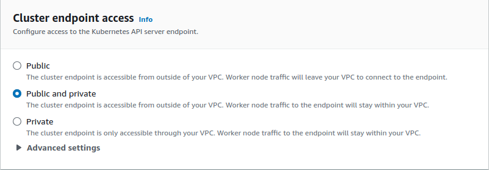
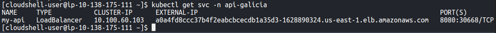

# Documentación de CI/CD para API REST

Este documento describe el proceso de Integración Continua y Despliegue Continuo (CI/CD) para una API REST utilizando GitHub, Jenkins (Corriendo en una maquina EC2), DockerHub, y ArgoCD corriendo en un clúster de Amazon EKS.


## Descripción General

El flujo de CI/CD está diseñado para automatizar la construcción, y despliegue de la API REST. Se utiliza un pipeline en Jenkins para gestionar los procesos de CI.

### Herramientas Utilizadas

- **GitHub**: Almacena el código fuente y los manifiestos de Kubernetes.
- **Jenkins**: Automatiza la construcción y pruebas del proyecto.
- **Docker Hub**: Repositorio para almacenar las imágenes de Docker construidas.
- **ArgoCD**: Automatiza el despliegue en el clúster de Amazon EKS.


## Proceso de CI/CD

### 1. Integración Continua (CI)

#### Paso 1: Instalacion de Jenkins

En este caso, utilizamos una instancia de EC2, del tipo t2.medium.


#### Paso 2: Configuracion Pipeline

Una vez instalado Java, Jenkins y Docker, procedemos a crear nuestro Pipeline en Jenkins. En este caso utilizamos un Pipeline normal, en general se utiliza un Multibranch Pipeline, pero para este ejemplo, como solo vamos a utilizar main, seleccionamos la opcion de Pipeline.


Configuramos el pipeline con nuestros datos.


Y especificamos que rama va a ejecutar el proceso cuando se haga un commit. En este caso, main. Configuramos donde esta ubicado el Jenkinsfile, el cual tiene varios Steps.


#### Paso 3: Ejecucion del Pipeline

La idea de este Pipeline, es que cada vez que se pushea a la rama main, empiece a correr el pipeline, el cual obtiene el ultimo TAG, y crea la imagen en base a ese TAG.


- **Trigger**: Cada `push` en la rama `main` activa el pipeline de Jenkins.
- **Clonación**: Jenkins clona la última versión del repositorio.
- **Construcción**: Se construye la imagen de Docker de la API.
- **Etiquetado**: La imagen se etiqueta con el ultimo TAG.
- **Autenticación**: Jenkins se autentica en Docker Hub.
- **Push**: La imagen se sube a Docker Hub.
- **Actualización**: Los manifiestos de Kubernetes en GitHub se actualizan con la nueva imagen.
- **Limpiar Workspace**: Se limpia el directorio de Workspace de Jenkins.
- **Docker logout**: Se realiza el logout de Docker.


NOTAS: En este caso la carpeta 'manifest' se encuentra dentro del mismo repositorio del codigo, NO es recomendable ya que al correr el pipeline exitosamente, va a realizar un nuevo commit y va a correr nuevamente dando error, ya que no hay un nuevo TAG. En este caso se creo en el mismo repositorio, para brindar 1 solo link.


### 2. Despliegue Continuo (CD)

#### Paso 1: Creacion de cluster EKS

Ingresamos a la consolo de AWS, buscamos el servico EKS, y creamos un nuevo Cluster. Le definimos el nombre, vpc, subnetes, security groups, cluster endopint.





#### Paso 2: Creacion de node group

Luego de unos 10/15 minutos que tarda el levantar el cluster, vamos a configurar los node group.


#### Paso 3: Configuracion de ArgoCD

Para ello, ingresamos a la CLI AWS, y ejecutamos el siguiente comando para actualizar kubeconfig.
```
aws eks update-kubeconfig --name eks-margus --region us-east-1
```

Luego creamos el namespace argocd ejecutnado el siguiente comando:
```
kubectl create namespace argocd
```

Instalamos ArgoCD, en el namespace de argocd, con el siguiente comando:
```
kubectl apply -n argocd -f https://raw.githubusercontent.com/argoproj/argo-cd/v2.4.7/manifest/install.yaml
```


Una vez que levantaron todos los servicios, vamos a cambiar el servie 'argocd-server', ya que por default viene del tipo 'ClusterIP' y nosotros lo queremos del tipo 'LoadBalancer', para ello ejecutamos el siguiente comando:
```
kubectl patch svc argocd-server -n argocd -p '{"spec": {"type": "LoadBalancer"}}'
```
Y revisamos que haya cambiado correctamente con el siguiente comando:
```
kubectl get svc -n argocd
```


Como podemos ver, tenemos la ruta para ingresar a nuestro ArgoCD en el puerto 80.


Para obtener la password inicial, tenemos que ejecutar el siguiente comando:
```
kubectl -n argocd get secret argocd-initial-admin-secret -o jsonpath="{.data.password}" | base64 -d
```

#### Paso 4: Configuracion de apliacion en ArgoCD
Una vez cambiado el password, vamos a la opcion 'Repositorios" y agregamos nuestro repositorio donde se encuentran nuestros manifiestos. Luego procedemos a crear nuestra aplicacion.


Podemos ver que empieza a sincronizar automaticamente.


Ejecutamos el siguiente comando en nuestro CLI, para ver la ruta de nuestra aplicacion:
```
kubectl get svc -n api-galicia
```


Ingresamos a nuestra API:


Le agregamos /swagger a la ruta.
```
/swagger
```


Y podemos ejecutar un GET al endpoint /healthcheck.


## Consideraciones Finales
- Este pipeline asegura que cualquier cambio en `main` se construye, y despliega automáticamente, manteniendo la integridad y disponibilidad de la aplicación.
- Una vez actualizado los manifiestos, Argo detecta un cambio y automaticamente despliega la nueva version utilizando la estrategia 'RollingUpdate' en el cluster EKS.
 
## Mejoras a realizar
- Utlizar Terraform para levantar la infraestructura en AWS.
- Tener los manifiestos en otro repositorio.
- Agregar TESTs en el proceso, como por ejemplo: Unit test, Security test, Hadolint.
- Tenes las imagenes utilizadas en el README.md en un Bucket S3.
